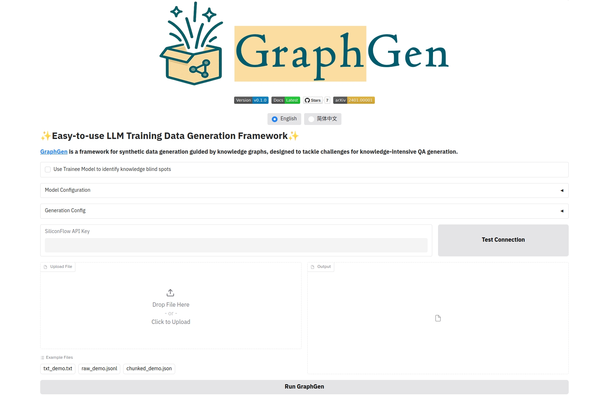
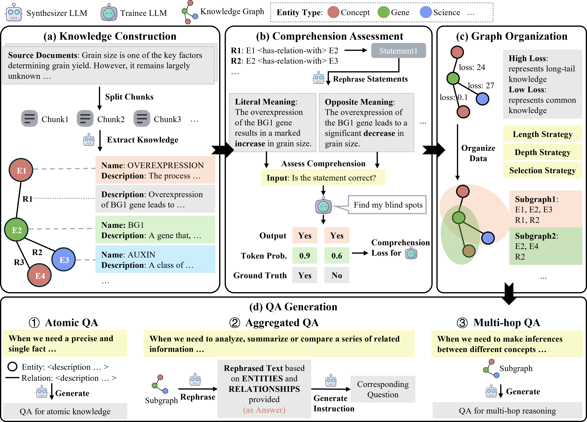

<p align="center">
  
</p>

<!-- icon -->

[](https://github.com/open-sciencelab/GraphGen)
[](https://github.com/open-sciencelab/GraphGen)
[](https://github.com/open-sciencelab/GraphGen/issues)
[](https://github.com/open-sciencelab/GraphGen/issues)


<p align="center">
  <a href="README.md">English</a> | <a href="README_zh.md">简体中文</a>
</p>

GraphGen: Enhancing Supervised Fine-Tuning for LLMs with Knowledge-Driven Synthetic Data Generation

<details>
<summary><b>📚 Table of Contents</b></summary>

- 📝 [What is GraphGen?](#-what-is-graphgen)
- 🚀 [Quick Start](#-quick-start)
- 📌 [Latest Updates](#-latest-updates)
- 🌟 [Key Features](#-key-features)
- 🏗️ [System Architecture](#-system-architecture)
- ⚙️ [Configurations](#-configurations)
- 📅 [Roadmap](#-roadmap)
- 💰 [Cost Analysis](#-cost-analysis)

</details>

## 📝 What is GraphGen?

GraphGen is a framework for synthetic data generation guided by knowledge graphs. 

It begins by constructing a fine-grained knowledge graph from the source text，then identifies knowledge gaps in LLMs using the expected calibration error metric, prioritizing the generation of QA pairs that target high-value, long-tail knowledge.
Furthermore, GraphGen incorporates multi-hop neighborhood sampling to capture complex relational information and employs style-controlled generation to diversify the resulting QA data. 

## 🚀 Quick Start
[//]: # (TODO)

### Command Line

### Gradio Demo



### Run from Source

1. Install dependencies
    ```bash
    pip install -r requirements.txt
    ```
2. Configure the environment
    ```bash
    cp configs/llm_config.yaml.example configs/llm_config.yaml
    ```


## 📌 Latest Updates

## 🌟 Key Features

## 🏗️ System Architecture

### Directory Structure
```text
├── baselines/           # baseline methods
├── cache/               # cache files
│   ├── data/            # generated data
│   ├── logs/            # log files
├── configs/             # configuration files
├── graphgen/            # GraphGen implementation
│   ├── operators/       # operators
│   ├── graphgen.py      # main file
├── models/              # base classes
├── resources/           # static files and examples
├── scripts/             # scripts for running experiments
├── templates/           # prompt templates
├── utils/               # utility functions
├── webui/               # web interface
└── README.md
```


### Workflow


## ⚙️ Configurations

## 📅 Roadmap

## 💰 Cost Analysis
